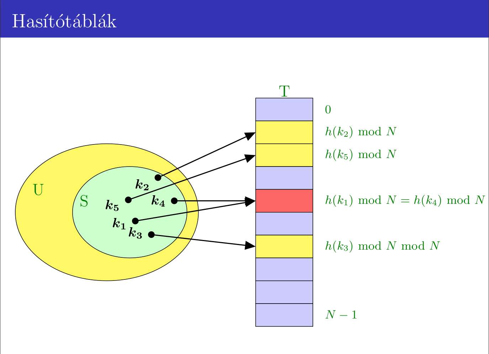
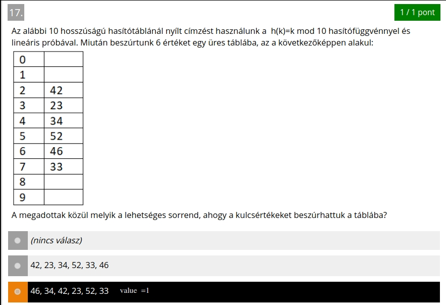
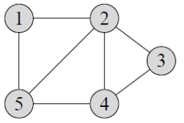
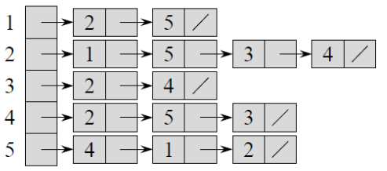
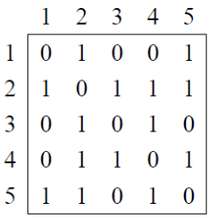
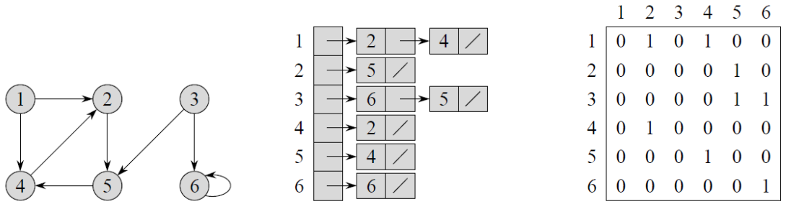

# Elemi adatszerkezetek, bináris keresőfák, hasító táblázatok, gráfok és fák számítógépes reprezentációja.

## Elemi adatszerkezetek
> A következő példákban az elemek száma n., legrosszabb eset = LRE
#### Tömb
- Ugyanolyan tı́pusú elemek
- Előre definiált méret (nem lehet megváltoztatni futás során)
- Idő:
  - **Elérési idő: O(1)** = elemek egymás után folyamatosan tárolódnak a memóriában
  - **Beszúrás: O(n)** LRE, ha a tömb elejére akarunk beszúrni és minden eddigi elemet arrébb kell rakni.
  - **Törlés: O(n)** LRE, ha a tömb elejéről törlünk és minden további elemet egyel előrébb kell rakni
  - **Keresés: O(log n)**, ha rendezett a tömb (bináris keresés) és O(n), ha nem (szekvenciális keresés)
#### Láncolt listák
- Minden elem 
  - egy adatból 
  - és egy (vagy több) mutatóból áll
- A mérete futás során módosı́tható
- Típusai:
  1. **Egyirányú lista:** minden elem egy adatot és egy rákövetkező elemre mutató
       pointert/referenciát tárol. Az utolsó elem pedig egy NULL-ra mutat. 
     - Például: 1 → 2 → 3 → 4 → N U LL
  2. **Kétirányú lista:** minden elem két pointert/referenciát tárol az adat mellett.
     Egyet a rákövetkező elemre, egy másikat a megelőzőre.
     Előnye, hogy mindkét irányban bejárható és törlésnél nem kell tudnunk a
     megelőző csúcs cı́mét. Az első és utolsó eleme is NULL. 
     - Például: N U LL ← 1 ↔ 2 ↔ 3 → N U LL
  3. **Körben láncolt lista:** az összes elem egy körbe van kötve. Nincs NULL elem
     a ,,végén”, az utolsó csúcs rákövetkező pointere az első elemre mutat. Lehet
     egyirányú és kétirányú láncolt is.
     Előnye, hogy bármelyik elemet kijelölhetjük kezdő elemnek.
- Idő:
  - **Elérési idő: O(n)**, mert a lista elejétől végig kell keresni
  - **Beszúrás: O(1)**, ha már azon a pozı́ción vagyunk, ami után be akarunk szúrni
  - **Törlés: O(1)**, ha már a törölt elem pozı́cióján vagyunk és tudjuk a törölni kı́vánt csúcs megelőzőjének a cı́mét (vagy ha a megelőző elemen vagyunk)
  - **Keresés: O(n)**
#### Verem
- A verem egy **LIFO** (last in, first out) adatszerkezet
- Két műveletet támogat:
  - **push**: egy elemet hozzáadunk az eddigiekhez úgy, hogy a verem tetejére tesszük
  - **pop**: az utoljára beszúrt elemet veszi ki a veremből (a tetejéről)
- Idő:
  - **Elérési idő: O(1)**, de csak a verem tetején lévő elemet tudjuk elérni
  - **Beszúrás: O(1)**, mert mindig a tetejére pakolunk
  - **Törlés: O(1)**, de csak a tetején lévő elemet tudjuk törölni
- Pl: 3, 6, 10, 8, 1, 9, 7 számsorozat
  - LIFO: 7, 9, 1, 8, 10, 6, 3
#### Sor
- A sor egy **FIFO** (first in, first out) adatszerkezet
- Két műveletet támogat:
  - **enqueue**: egy új elemet adunk hozzá úgy, hogy a sor végére szúrjuk be
  - **dequeue**: az első elemet töröljük a sorb
- Idő:
  - **Elérési idő: O(n)** LRE
  - **Beszúrás: O(1)**
  - **Törlés: O(1)**
- Pl: 3, 6, 10, 8, 1, 9, 7 számsorozat
  - FIFO: 3, 6, 10, 8, 1, 9, 7
#### Prioritási Sor
- Absztrakt adatszerkezet, melyben az elemeket prioritásuk szerint tároljuk
- Három műveletet támogat:
  - **insert**: beszúr egy elemet
  - **pop**: kiveszi a legkisebb prioritású elemet
  - **min**: a legkisebb prioritású elemet adja vissza (pl. int-ek esetén minimumot)
- Idő:
  - **Min: O(1)**
  - **Beszúrás: O(log n)**
  - **Törlés: O(log n)**
- Pl: 3, 6, 10, 8, 1, 9, 7 számsorozat
  - rendezés: 1, 3, 6, 7, 8, 9, 10

## Bináris keresőfák
### Bináris fa
- **Bináris fa**: minden csúcsnak legfeljebb 2 gyereke van
- **Teljes (full) bináris fa**: olyan bináris fa, ahol minden szint teljesen ki van töltve
- **Majdnem teljes (complete) bináris fa**: olyan bináris fa, ahol maximum a legalsó
  szint nincs teljesen kitöltve, csak balról jobbra haladva kitöltött néhány elemig
- **Kiegyensúlyozott bináris fa:** olyan fa, ahol minden csúcs gyerekeinek részfáinak
  magassága maximum eggyel tér el.
### Bináris keresőfák
> A bináris keresőfa egy olyan adatszerkezet, amely olyan elemeket tárol, melyeknek kulcsa
egy tejesen rendezett univerzumból való (pl. egészek). Feltesszük, hogy minden elem
kulcsa egyedi.
- A következő műveleteket támogatja:
  - **search(i)**: visszaadja azt az elemet, aminek a kulcsa i
  - **insert(i**): beszúrja az i kulcsú elemet a fába (ha még nem volt benne)
  - **delete(i)**: törli az i kulcsú elemet a fából, ha az létezik
- **Fontos tulajdonság:**
  - minden x csúcsra a bal részfájában
    lévő összes elem kisebb, mint az x kulcsa, mı́g a jobb részfájában lévő összes elem nagyobb,
    mint az x kulcsa.

#### SEARCH(i)
1. Ha a **gyökér** az, **adjuk vissza**
2. Ha a i **kisebb**, mint a gyökér kulcsa,
   keressük a **bal részfájában**, ha van neki
3. Ha a i **nagyobb**, mint a gyökér kulcsa,
   keressük a **jobb részfájában**, ha van
   neki
4. Ha a részfa, amire lépnénk x-ről, **nem
   létezik, adjuk vissza az x-et**

#### BESZÚRÁS(i)
1. Keressünk rá az i-re
   - ez ha még **nincs benne** a fában, **vissza fogja adni azt a csúcsot,
   ami alá be kell szúrni az i-t** (ő lesz a szülője).
   - ha benne van az i a fában, nem szúrunk be semmit
2. **Hozzunk létre egy új csúcsot (y) és szúrjuk be**:
   - Ha i kisebb, mint az x kulcsa, akkor bal gyereknek
   - Ha i nagyobb, mint az x kulcsa, akkor jobb gyereknek

#### TÖRLÉS(i)
_Három esetet lehetséges az x csúcs törlésekor:_
1. Ha x-nek **nincs gyerek**e, töröljük, a **szülő rá mutató pointerét NIL-re** cseréljük.
2. Ha x-nek pontosan **egy gyerek**e van c, mindegy, hogy bal vagy jobb gyerek volt,
   **felemeljük az x helyére** (x szülőjének gyereke c, c szülője az x szülője lesz).
3. Ha az x-nek **két gyerek**e van (c1 bal és c2 jobb gyerek), megkeressük az x közvetlen
   rákövetkezőjét z-t, és őt tesszük x helyére a fában.
   - Ebben az esetben jegyezzük meg, hogy mivel z a c2 gyökerű részfában van ı́gy
   egyszerűen rákereshetünk (search(c2, key(x))).
   - Viszont mivel z az x rákövetkezője, ı́gy biztosan nincs bal gyereke, viszont jobb
   gyereke még lehet.
   - Ha van jobb gyereke, állı́tsuk rá z szülőjének pointerét (és z gyerekének szülője
   legyen z szülője).
   - Cseréljük ki x-et z-vel és állı́tsuk be a megfelelő pointereket, majd töröljük x-et,
   mint az 1. esetben.
   (Egy másik megoldás, hogy x közve

## Hasító táblázatok

- A tábla egy oszlop, ami eleinte üres és ebbe megpróbálunk számokat belehelyezni
- Kapunk egy szabáyt(képletet) és egy modulo értéket amikkel dolgozni fogunk:
- 
  - Modulo = 10 = tábla hossza
  - Szabály = lineáris próba = (h(k) + i) mod N
    - Ahol i=iteráció_száma, N=modulo_érték, k=aktuális_szám
  
- Algoritmus:
  1. Kapunk egy számot (k) pl 46
  2. Lemodulózzuk (N számmal) 46 mod 10 = 6
  3. Megpróbáljuk beilleszteni a 6-os számú helyre
     - Ha sikerül(üres, nincs még szám beírva) --> continue; #Siker, ugrás a következő számra
     - Ha nem sikerül(már van szám beírva)
       - iv. A Szabályba behelyettesítünk
       - v. a kapott eredményt megpróbáljuk behelyettesítani 2. ponttól ismétlődik
         - Annyi iterációt megyünk ameddig nem lehet valahova betenni a számot a táblában.
  
- Pl:
  - 46, 34,42,23 bent van a táblában:
    - Modulo után 6, 4, 2, 3 helyek foglaltak
  - Megpróbáljuk az 52-t behelyezni
  - 52 mod 10 = 2
  - HOPPÁ a 2-es szám helyén már van szám a táblában
  - Jöjjön a szabály= (h(k) + i) mod N
  - h(k) = 2 , i=1 (mert a 1. iterációban vagyunk(0. az első)) N=10
  - (2 + 1) mod 10 = 3
  - Sajnos a 3 is foglalt :(, nézzük tovább
    - h(k) = 2 , i=2, N=10, (2 + 2) mod 10 = 4 --> Szintén foglalt
    - h(k) = 2 , i=3, N=10, (2 + 3) mod 10 = 5 --> Nem foglalt ---> betesszük az 5 ös helyre az 52-t

## Gráfok és fák számítógépes reprezentációja
- Fák
- Számítógépes reprezentáció: [261o]
1. Csúcsok halmaza és élek halmaza
  - Csúcsokat és éleket reprezentálunk
  - Maga a fa egy **mutató a gyökérre**
  - 
2. Szomszédsági listás ábrázolás
   3. 
3. Szomszédsági mátrix ábrázolás
4. 

#### Irányított gráf esetén
