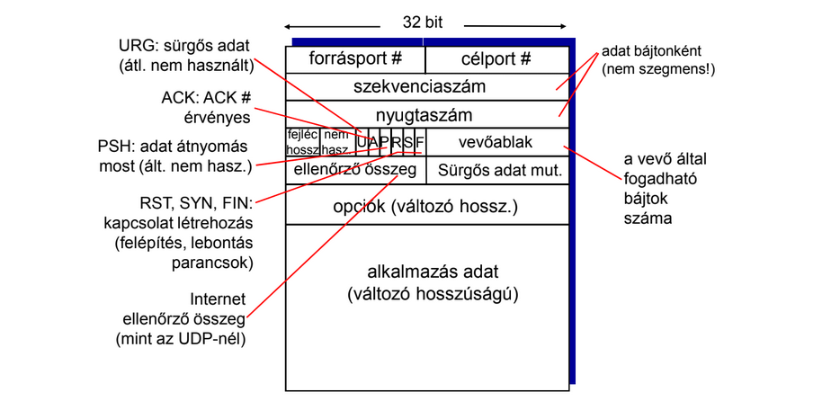
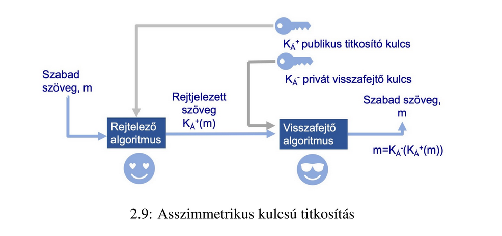
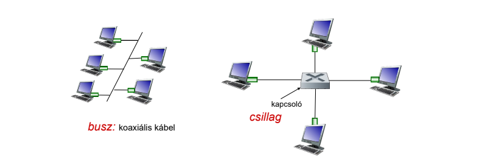

## TCP
> - Kapcsolatorientált átvitel: TCP
> - Mielőtt egy processzus adatot küldene egy másiknak,  ̋
egy ún. “kézfogást” kell megejteniük.

### Kézfogás
- biztonságos adatátvitelhez szükséges
- Két processzus között létrejött kapcsolat kétirányú (mindkét irányba történik adatcsere)
- pont-pont összeköttetésű (egy küldő és egy fogadó).

#### Péda három lépéses kézfogás
- Adott egy kliens és egy szerver 
1. Kliens kezdeményez: **[SYN]**
  - kliens processzus szól a szállítási rétegnek,
  hogy a szerveren futó processzushoz szeretne kapcsolódni.
  - A kliens megszólítja a szervert elérhetőségein keresztül (IP:port)
  - flag bitek közül a **SYN** beállításra kerül 1-es értékkel.
  - Ezen túl a kliens véletlenszerűen választ egy iniciális szekvencia számot, amelyet bele is helyez a
kezdo TCP SYN szegmensbe.

2. A szegmenst fogadja a szerver  **[SYNACK]**
  - visszaküld egy olyan szegmenst, amellyel a kapcsolódást
engedélyezi a szerver a kliensnek.
  - Elsoként a **SYN** és **ACK** flag bitek kerülnek beállításra 
    1-es értékkel

3. kliens elismeri a kapcsolódás jogát **[ACK]**
   - SYNACK szegmens fogadása
   - A kliens visszaküld egy nyugtát a szerver felé
   - A szegmensben kizárólag az ACK flag bit kerül beállításra
   (1-es érték), a SYN ilyenkor 0-t kap.

#### Kapcsolat lezárása
- kliens TCP egy speciális szegmenst küld ki,
amelyben a FIN flag bit kap 1-es értéket.

### TCP szegmens struktúra
- _87. odal

### Megfordulási idő és időtúllépés
- idotúllépés/újraküldés mechanizmust alkalmazza az  ̋
elveszett szegmensekbol adódó hibák kezeléséhez.
- **RTT**: csomagok oda-vissza megtett útjához szükséges idő.
  - változékony, nehéz megbecsülni
  - ha túl alacsony, túl sok az újraküldés
  - ha túl magas, sikertelen küldés esete után túl sokat kell várni

## HTTP (HyperText Transfer Protocol)

> - állapotmentes protokoll,
> - adott parancshalmaz segítségével lehetové teszi az
> URL-lel azonosított erőforrások manipulációját.
>    - pl: reprezentáció betöltése --> GET
  
### Kliens szerver paradigma:
  1. a kliens eroforrásokat kér a szervertől --> (request)
  2. a szerver ezt biztosítja, választ küld --> (response)
  
  - a szoftver nem feltételezi a kliens választartását
### Egy kérés tartalma:
- Kérés/Válasz sor
  - Parancshoz tartozó erőforrás cím
  - Állapotkód(szervertől jön)
- Fejlécek
  - Keresztülívelő információk --> Küldött tartalmától független
  - Pl:
    - böngésző típusa
    - szerver adatok 
- Törzs
  - Kért információ, itt lehet elküldeni a feltöltendő adatot (POST)

### HTTP Gyorsítótárazás
> a válasz gyorsítótárazható

- Pl: böngésző:
  - ha már egy kérésre ismert a válasz, akkor nem kérdezi meg a szervert,
    hanem azonnal válaszol rá. 

- Ezt a **CDN** (Content Delivery Network) Tartalom Elosztó Hálózat végzi
  - A tartalmat közelebb hozza a felhasználóhoz,
    hogy rövidebb úton el lehessen érni
  - Így **gyorsabban elérjük** a kért tartalmat 
  - Szerver terhelés csökken
  - a szerver megszólítása nélkül is üzemképes, 
    szerver rendelkezésre állása nem blokkoló

### HTTP Biztonság
- alapvető titkosítás, védelem nincs
- Titkosítást a TLS protokoll biztosíthat

## RSA
- A publikus kulcsú rejtjelező eljárás
- Az SSL/TLS protokoll része.[5]
- egy üzenet címzettjének nyilvános kulcsával történo titkosítást tesz
lehetové, mely a címzett titkos kulcsával dekódolható.
### Asszimetrikus kulcsú titkosítás
- 
- Egy kulcs helyett kettőt alkalmaznak
- `K-Á` titkos, privát kulcs, `K+Á` nyilvános publikus kulcs
- A sracnak van egy publikus és privat kulcsa
- A csajnak elkuldi a publikus kulcsat
- A csaj ezzel a publikus kulcsal rejtjelezi a szoveget
- elkuldi a sracnak az uzenetet
- A srac viszont a privat kulcsal tudja csak visszafejteni
  - `K-Á`(`K+Á`(üzenet)) = üzenet
  - a nyilvanos kulcsal nem lehet visszafejteni

### RSA algoritmus
- A moduló aritmetikán alapul:
- Algoritmus:
  - Válasszunk két nagy **p** és **q** prím számot (1024 bites nagyságrendűt)
  - Számítsuk ki 
    - **n** _= p · q_ és
    - **z** _= (p−1)·(q−1)_ számokat
  - Válasszunk ki egy e számot amely 
    - n-től kisebb és 
    - nincs közös osztója  z-vel.
  - ... szamhalo programozoknak pdf 30. oldal

### Mit tud az RSA?
- megoldja a kulcselosztás problémáját
- Viszont a `DES` és `AES` egyszerűbb algoritmusokat használnak

## PPP
> Többszörös hozzáférési protokollok
> - pont-pont összeköttetés
>   - átviteli közeg mindössze két szomszédos csomópontot köt össze,
> Összességében egy magas szintű adatkapcsolati protokoll kétpontos vonalakhoz.

### Többszörös hozzáférési vagy broadcast közegek
- egyszerre több kommunikáló fél próbálja küldeni és fogadni az értékes kereteket
  - Pl Ethernet hálózat, LAN

#### Ütközés - többszörös hozzáférési probléma
- egyszerre érkezik ketto vagy több forrásból keret
- felek pedig képtelenek  értelmezni és javítani a kavarodást,
- minden átküldött, értékes adat elveszik.

## Ethernet
> A LAN-ok kialakítására több lehetséges technológia van, 
> legnépszerűbb az Ethernet,
- relatíve olcsó
- könnyen kiépíthető
- magas sebességű

#### Topológia típusok

- BUSZ
  - a csomópontok sínszerűen csatlakoztak koaxiális kábellel egy ütközési tartományra
- CSIALLG
  - a hálózat csomópontjai egy központi eszközön keresztül csatlakoznak egymáshoz direkt
kapcsolatok nélkül.

## IP
